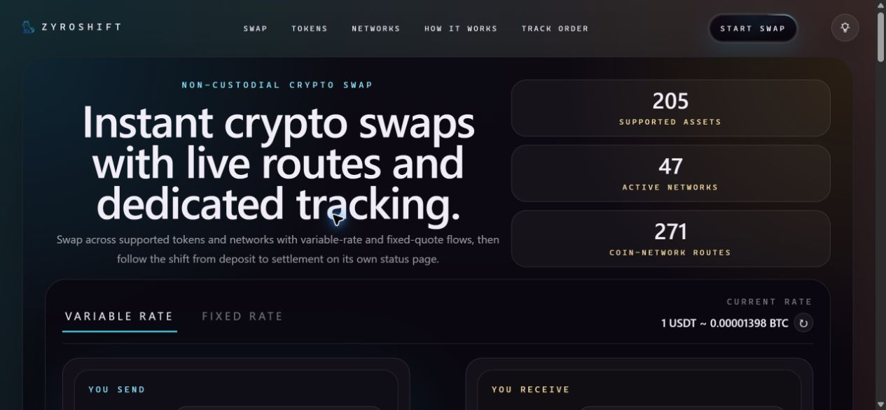
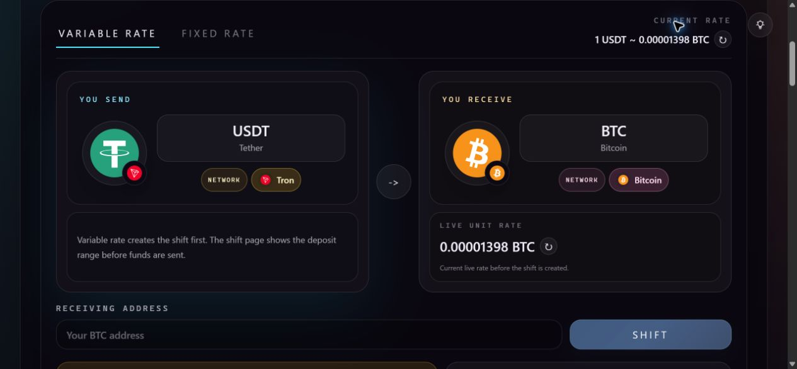
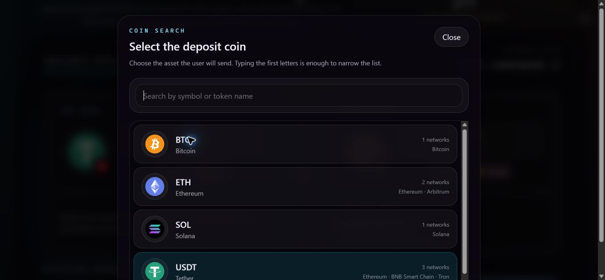
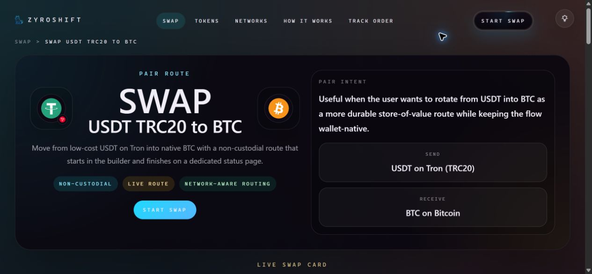

  

<strong>Crypto swaps with clear asset selection and dedicated order tracking.</strong>

Next.js · React · TypeScript · Tailwind CSS

<a href="mailto:support@zyroshift.com?subject=ZyroShift%20project%20enquiry">Discuss the project</a> · <a href="docs/architecture.md">Architecture</a> · <a href="docs/commercial-options.md">Commercial options</a>

ZyroShift brings asset selection, network selection, swap quotes and order tracking into one branded web experience. I built the project over approximately three months, working across interface design, application logic, API integration and search-oriented content architecture.

This public showcase presents the product, its architecture and ways to work together. Implementation source is maintained separately, with access and delivery scope agreed for each engagement.

## Interface preview

Real screenshots of the local application, captured in September 2026. Rates and route data shown in the swap interface use demo mode; these images do not represent live quotes or completed transactions.

**Homepage**

**Swap builder — token/network selection and destination address entry**

| Token selection | Dedicated swap-pair page |
| --- | --- |
|  |  |

Click any image to view it at full size. To see the interface in action, [request a product walkthrough](mailto:support@zyroshift.com?subject=ZyroShift%20product%20walkthrough).

## Product capabilities

| Area | Implementation |
| --- | --- |
| Swap interface | Token and network selection, amount entry and destination address input |
| Quotes and orders | Variable-rate swaps and fixed-rate quotes/orders |
| Tracking | Dedicated shift pages, status polling, deposit QR codes and cancellation flow |
| Product experience | Responsive layouts and light/dark themes |
| Discovery | Swap-pair pages, token and network directories, guides and price pages |
| Search architecture | Structured metadata, internal linking, sitemaps and staged indexability rules |

An additional affiliate portal is available in the local development version, covering registration, referral tracking, dashboards and commission records. Its release status and delivery scope are described in the [architecture notes](docs/architecture.md#affiliate-extension).

## Engineering focus

- Keep provider integration behind application server routes.
- Turn token/network metadata into a usable route-selection experience.
- Handle the journey from a quote to deposit instructions and order status.
- Structure a large family of discovery pages with explicit publishing rules.
- Support provider affiliate attribution as part of order creation.

Swap execution uses an external exchange provider. See the [architecture notes](docs/architecture.md#exchange-integration) for the integration and operating requirements.

## Availability

The hosted demo is temporarily unavailable. Email **[support@zyroshift.com](mailto:support@zyroshift.com?subject=ZyroShift%20product%20walkthrough)** to request a recorded video walkthrough or arrange a live walkthrough via UltraViewer using the local demo.

## Work with me

I am open to discussing:

- **Project acquisition:** a negotiated handover of agreed code, documentation and project assets.
- **Source licensing:** a defined version for an agreed deployment or business use.
- **Custom implementation:** branding, interface changes, integration work and related web applications.

Email **[support@zyroshift.com](mailto:support@zyroshift.com?subject=ZyroShift%20project%20enquiry)** with your intended use, preferred scope and timeline. See [commercial options](docs/commercial-options.md) for the handover boundaries.

The showcase does not grant a software license. Commercial rights and delivery terms are agreed separately, subject to applicable third-party rights.

Built by [furydu](https://github.com/furydu).
