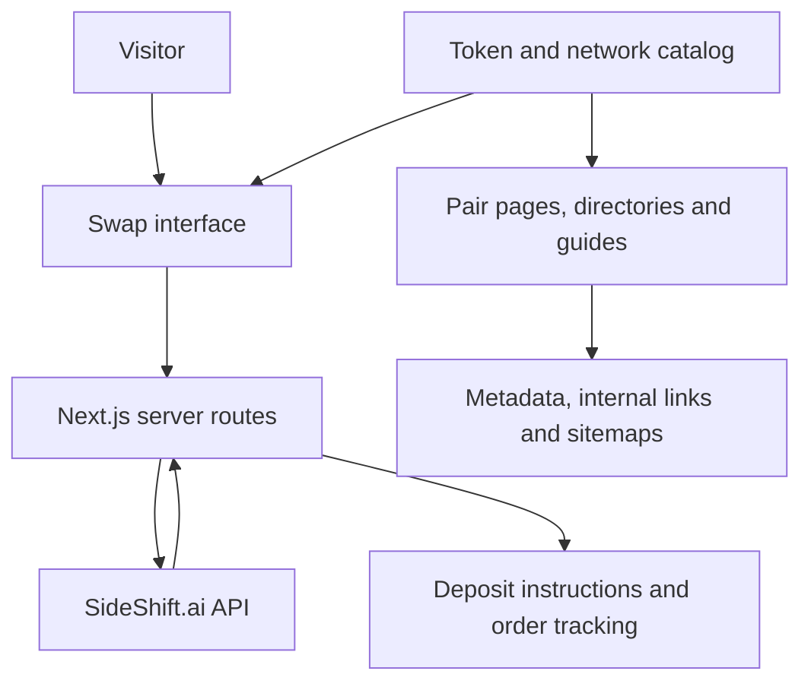

# Architecture

ZyroShift is a Next.js application with a React interface, TypeScript application code and a SideShift.ai API integration.

## Swap workflow

1. A visitor selects the source and destination asset/network.
2. Server routes retrieve provider permissions, available assets and quotes.
3. The visitor supplies an amount and destination address.
4. The application requests a variable shift or a fixed quote and fixed shift.
5. A dedicated page presents deposit instructions and polls order status.

Exchange execution, supported routes and settlement behavior depend on SideShift. The application contains a development mock mode for supported flows; that mode is not proof of a successful live trade.

## Exchange integration

ZyroShift integrates the SideShift.ai API for quotes, shift creation and order status. ZyroShift provides the application interface, server-side integration and product experience; SideShift supplies exchange execution.

The integration supports provider affiliate attribution. Commission eligibility and payment depend on provider terms and actual completed activity; this showcase includes no verified revenue figures. A buyer needs valid provider credentials and must meet the provider's operating requirements. API secrets are configured on the server and are excluded from the public showcase.

See the provider's [integration documentation](https://docs.sideshift.ai/) and [monetization documentation](https://docs.sideshift.ai/api-intro/monetization/). Deployment setup, provider access and any account transfer are agreed separately during handover.

## Content architecture

The project includes a token catalog, network taxonomy, pair definitions, guide templates and publishing/indexability rules. These connect product navigation with dedicated discovery pages. The existence of these pages does not establish traffic, search rankings or indexed-page counts.

## Affiliate extension

An additional local module includes referral links/cookies, affiliate registration and login, dashboards, administrative views and settlement records in Neon/Postgres. Webhook and scheduled status-sync routes are present in that local version. Its commission ledger uses configured fee assumptions; it does not establish provider-confirmed earnings or automated on-chain payouts.

This extension remains separate from the earlier source revision. Its release status and validation evidence must be specified in a commercial delivery.

## Technology

| Layer | Technology |
| --- | --- |
| Application | Next.js App Router |
| UI | React, TypeScript, Tailwind CSS |
| Swap integration | SideShift.ai API v2 |
| QR presentation | qrcode.react |
| Affiliate storage in local extension | Neon / Postgres |
| Deployment configuration | Vercel |

Dependency versions and operating instructions belong with the specific source release delivered to a buyer.
